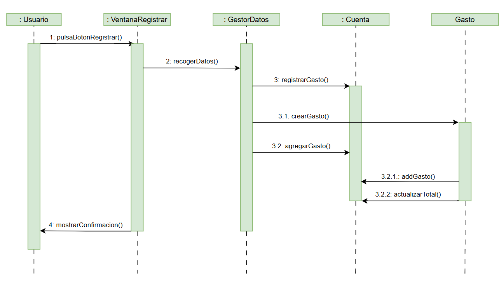
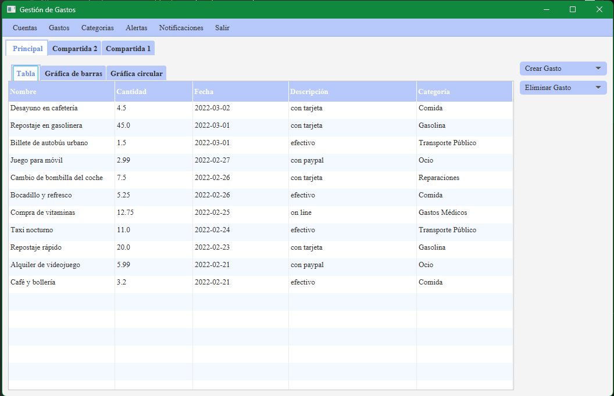
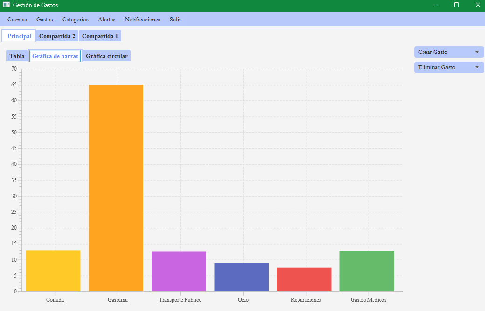
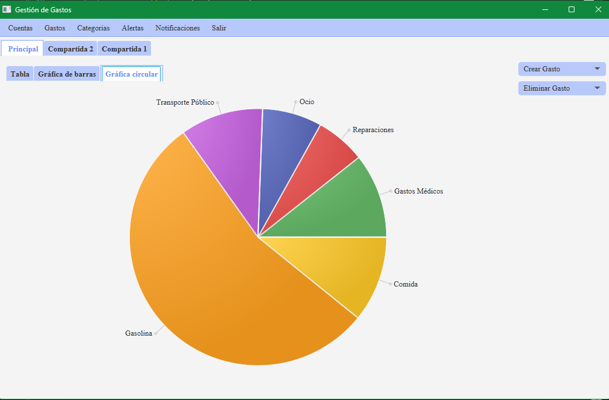
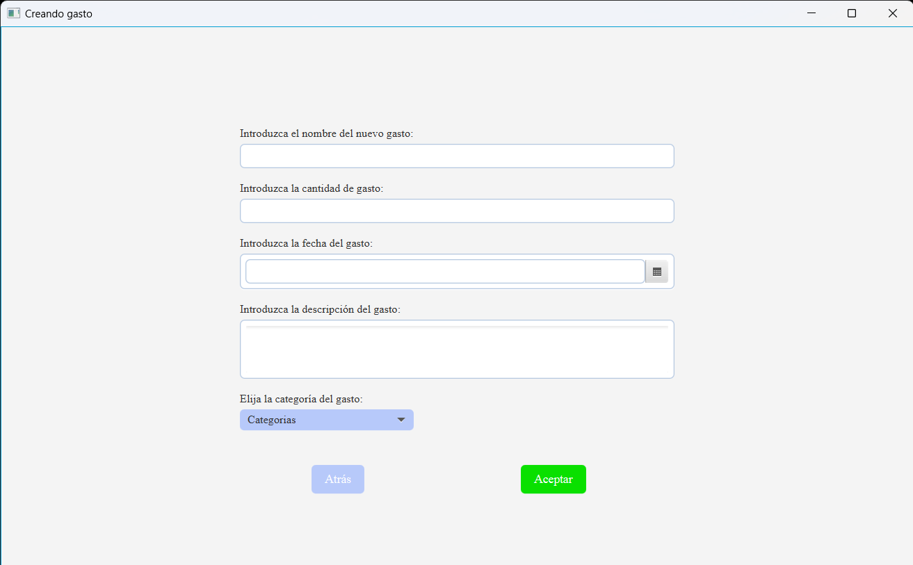
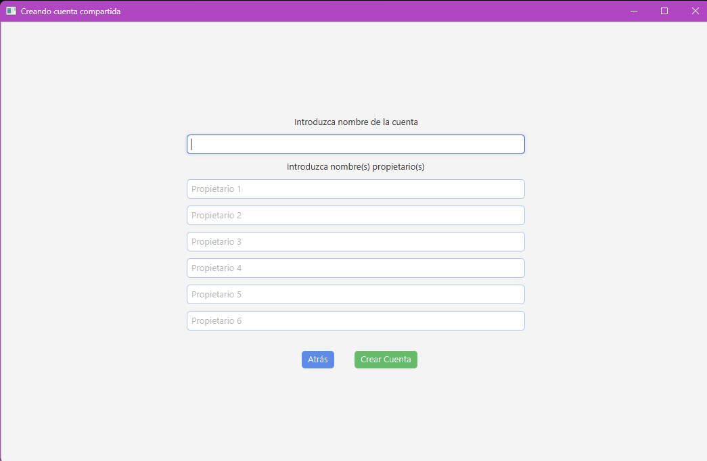
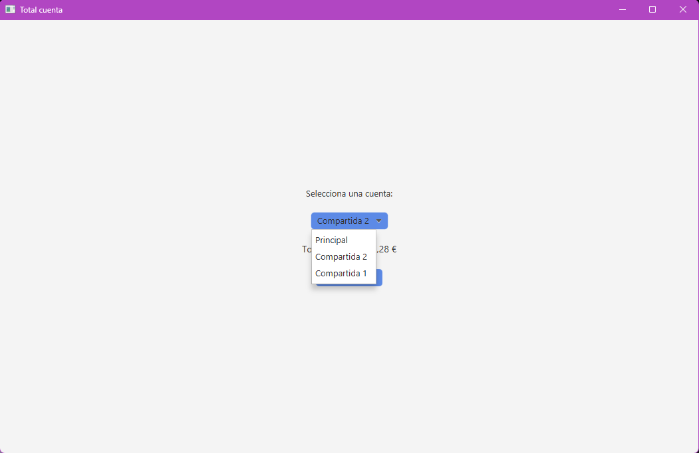

# DOCUMENTACIÓN DEL PROYECTO
## DIAGRAMA DE CLASES DEL DOMINO DEL PROYECTO
Diseñamos el siguiente diagrama de clases del dominio del proyecto:

En él se muestran las clases principales del dominio junto con sus relaciones dentr de la aplicación.

## ESPECIFICACIÓN DE LAS HISTORIAS DE USUARIO DEL PROYECTO
A continuación se muestran las historias de usuario del sistema:

**Historia de Usuario 1: Crear una cuenta personal**
- Como usuario,
- quiero crear una cuenta personal,
- para gestionar mis gastos.

**Historia de Usuario 2: Eliminar una cuenta**
- Como usuario,
- quiero eliminar una cuenta,
- para eliminar las cuentas que ya no necesito.

**Historia de Usuario 3: Crear una cuenta compartida**
- Como usuario,
- quiero crear una cuenta compartida con varias personas,
- para gestionar gastos comunes.

**Historia de Usuario 4: Añadir personas a una cuenta compartida**
- Como usuario,
- quiero añadir participantes a una cuenta compartida,
- para que puedan aparecer como que hacen un gasto.

**Historia de Usuario 5: Registrar un gasto**
- Como usuario,
- quiero registrar un gasto, utilizando su nombre, cantidad, fecha y categoría,
- para llevar un control de mis movimientos.

**Historia de Usuario 6: Registrar un gasto en una cuenta compartida**
- Como usuario,
- quiero registrar un gasto en una cuenta compartida, indicando quién lo ha pagado,
- para llevar un control de los movimientos de la cuenta.

**Historia de Usuario 7: Eliminar un gasto**
- Como usuario,
- quiero eliminar un gasto,
- para eliminar gastos incorrectos o que ya no quiero tener en cuenta.

**Historia de Usuario 8: Ver los gastos de una cuenta**
- Como usuario,
- quiero ver todos los gastos asociados a una cuenta,
- para poder ver el total de gastos que he realizado.

**Historia de Usuario 9: Ver categorías**
- Como usuario,
- quiero ver las categorías existentes,
- para poder ver las categorías predefinidas.

**Historia de Usuario 10: Crear una categoría personalizada**
- Como usuario,
- quiero crear nuevas categorías de gasto,
- para poder añadir nuevas categorías en las que clasificar mis gastos.

**Historia de Usuario 11: Eliminar una categoría**
- Como usuario,
- quiero eliminar una categoría,
- para poder eliminar categorías que ya no necesito.

**Historia de Usuario 12: Crear una alerta de gasto**
- Como usuario,
- quiero crear una alerta,
- para marcarme un límite de gastos semanal o mensual.

**Historia de Usuario 13: Crear una alerta para una categoría**
- Como usuario,
- quiero crear una alerta,
- para marcarme un límite de gastos en una categoría concreta.

**Historia de Usuario 14: Recibir una notificación al superar una alerta**
- Como usuario,
- quiero recibir una notificación cuando supere el límite de gastos de una alerta,
- para ser consciente de que he superado el límite que me puse.

**Historia de Usuario 15: Marcar notificaciones como leídas**
- Como usuario,
- quiero poder marcar mis notificaciones como leídas,
- para poder saber cuáles he leído y cuáles son nuevas.

**Historia de Usuario 16: Importar gastos desde un fichero**
- Como usuario,
- quiero importar gastos desde un fichero,
- para poder importar mis ficheros de gastos de golpe.

**Historia de Usuario 17: Filtrar gastos por fecha**
- Como usuario,
- quiero filtrar los gastos que hice entre dos fechas o por mes,
- para poder ver mis gastos en un periodo de tiempo.

**Historia de Usuario 18: Filtrar gastos por categoría**
- Como usuario,
- quiero filtrar mis gastos por categoría,
- para poder ver cuánto he gastado en una categoría en concreto.

**Historia de Usuario 19: Consultar el saldo de cada persona en una cuenta compartida**
- Como usuario,
- quiero ver el saldo de cada persona en una cuenta compartida,
- para poder ver cuánto debe o le deben a una persona de la cuenta compartida.

## DIAGRAMA DE INTERACCIÓN PARA UNA DE LAS HISTORIAS DE USUARIO
Hemos decidido hacer el diagrama de interacción de la Historia de Usuario 5: Registrar un gasto.

**Historia de Usuario 5: Registrar un gasto**
- Como usuario,
- quiero registrar un gasto, utilizando su nombre, cantidad, fecha y categoría,
- para llevar un control de mis movimientos.

A continuación se muestra su diagrama de interacción:

## ARQUITECTURA DE LA APLICACIÓN
La aplicación la hemos diseñado con una arquitectura en capas, en la que se distinguen:
* **La interfaz de usuario (tds.vista) ->** Tenemos varias clases Controller (por ejemplo, CrearAlertaController o CrearCategoriaController), que se encargan de gestionar las ventanas, actuando como puente entre la interfaz y el dominio. 
* **La lógica de aplicación (tds.controlador) ->** Hemos creado un GestorGastos, el cuál actúa como controlador. Este se encarga de coordinar las operaciones que le solicite la interfaz.
* **El dominio (tds.modelo) ->** Contiene las interfaces de las entidades principales de la aplicación, que serían: Cuenta, CuentaCompartida, CuentaPersonal, Gasto, Categoría, Persona, Alerta, Notificacion, Filtro, EstrategiaAlerta, EstrategiaDistribucion y PeriodoAlerta.
Mediante EstrategiaAlertaFactory y EstrategiaDistribucionFactory tenemos factorías, que se encargan de ls creación de estrategias.
En /tds/modelo/impl tenemos las implementaciones de nuestras entidades.
* **La persistencia (tds.adapters.repository) ->** Mediante repositorios JSON se almacena toda la información en un único fichero, facilitando la gestión de datos.

## DECISIONES DE DISEÑO
Durante la creación de la aplicación, hemos tenido que tomar varias decisiones de diseño. Algunas de ls más destacables son:
* **Separar interfaces e implementaciones en el dominio ->** Como hemos explicado en el apartado anterior, hemos decidido separar las interfaces (/tds/modelo) y las implementaciones (/tds/modelo/impl). De esta forma hemos conseguido facilitar la persistencia y permitir que fuera más sencillo ir añadiendo implementaciones.
* **GestorGastos como único controlador ->** Creamos un único controlador llamado GestorGastos, al que la interfaz llama y él se encarga de llamar al dominio. De esa forma, la interfaz no tiene que acceder directamente al modelo.
* **Persistencia mediante JSON ->** Decidimos almacenar toda la información en un único fichero JSON. Así, podíamos cambiar el mecanismo de persistencia sin afectar al resto del programa.
* **Gestión de gastos en cuentas compartidas ->** Decidimos que la aplicación recaulculará los saldos automáticamente al añadir o eliminar un gasto a la cuenta compartida.
* **Si los porcentajes personalizados no suman 100%, se toma DistribucionEquitativaImpl ->** Hemos decidido que en el caso de que los porcentajes introducidos por el usuario no sumen el 100%, en lugar de dar error y bloquearse, se haga una distribución equitativa de porcentajes entre los miembros de la cuenta.
* **Las cuentas personales ignoran el pagador ->** Como en las cuentas personales no va a insertar gastos más que una persona, el propietario del gasto no afecta al cálculo del total.
* **Las alertas sólo saltan al superar el límite ->** Tuvimos la duda de si la alerta debería saltar cuando gastoActual >= limite o si cuando gastoActual > limite. Al final decidimos que saltaran cuando se supere el límite (es decir, cuando gastoAcctual > limite), no al alcanzarlo.

## PATRONES DE DISEÑO USADOS
Hemos utilizado varios patrones de diseño de los vistos en clase:
* **Patrón GRASP Controller ->** La clase GestorDatos actúa como puente entre la interfaz de usuario y el dominio. Recibe las peticiones de la vista y llama a las operaciones necesarias.
* **Patrón Strategy ->** Se utiliza para poder repartir los gastos de distintas formas dentro de una cuenta compartida. Por ejemplo, a la hora de calcular el porcentaje, la cuenta no sabe cómo se calcula, sino que delega en la estrategia para que lo haga.
* **Patrón Decorator para los filtros ->** Los filtros de gastos se implementan mediante el patrón Decorator, que permite combinar filtros sin cerar una combinación fija. Es decir, se pueden añadir nuevos filtros sin modificar los existentes.
* **Patrón Factory Method ->** Utilizamos las factorías para decidir qué estrategia de distribución crear (Según el id) y para importar ficheros, ya que hay que seleccionar cómo importar según el tipo de archivo.
* **Patrón Singleton ->** Con él garantizamos tener una única instancia global. Se usa en GestorGastos.getInstancia(). Es importante porque no puede ser que en el sistema existan dos controladores de aplicación.

## MANUAL DE USUARIO
A continuación especificamos un manual de usuario para indicar el uso de la aplicación.
Comenzamos en la **ventana principal**. Al abrir la aplicación se crea automáticamente la cuenta Principal y se nos abre la ventana principal de la Cuenta.

Además de ver el listado de gastos de la cuenta Principal en formato de listado (o tabla) también podemos verlo como **gráfica de barras o como gráfica circular**. Para ello, pulsamos las pestañas Gráfica de barras o Gráfica circular respectivamente.

Para **crear un gasto nuevo en la cuenta Principal**, debemos pulsar el botón "Crear Gasto" que queda a la derecha del listado de gastos. A continuación, se debe pulsar "Gasto Nuevo". Se nos abrirá una pestaña en la que deberemos introducir los datos del gasto y pulsar "Aceptar".

Para **eliminar un gasto en la cuenta Principal**, debemos pulsar el botón "Eliminar Gasto" que queda a la derecha del listado de gastos. A continuación, se desplegará un listado con todos los gastos de la cuenta Principal, por lo que simplemente debemos pulsar el que deseemos eliminar.

Para **crear una nueva cuenta compartida**, deberemos ir a la barra de la parte superior de la aplicación. Una vez en ella, debemos pulsar "Cuentas" -> "Crear Cuenta". Se nos abrirá una pestaña en la que podremos introducir los datos de esta nueva conta compartirla y pulsar "Crear Cuenta" para crearla.

Para **eliminar una cuenta**, deberemos ir a la barra de la parte superior de la aplicación. Una vez en ella, debemos pulsar "Cuentas" -> "Eliminar Cuenta". Se nos abrirá un desplegable con todas las cuentas existentes. Pulsamos la cuenta que deseamos eliminar.

Para calcular el **total de una cuenta**, deberemos ir a la barra de la parte superior de la aplicación. Una vez en ella, debemos pulsar "Cuentas" -> "Total Cuenta". Se nos abrirá una pestaña en la que podremos seleccionar la cuenta de la que queramos saber el total.

