# PROJECT DOCUMENTATION

## DOMAIN CLASS DIAGRAM
We designed the following domain class diagram for the project:

It displays the main domain classes along with their relationships within the application.

## APPLICATION ARCHITECTURE
We designed the application using a layered architecture, distinguishing the following:
* **User Interface (tds.vista) ->** We have several Controller classes (e.g., `CrearAlertaController` or `CrearCategoriaController`) that are responsible for managing the windows, acting as a bridge between the interface and the domain.
* **Application Logic (tds.controlador) ->** We created a `GestorGastos` (Expense Manager), which acts as the controller. It is responsible for coordinating the operations requested by the interface.
* **Domain (tds.modelo) ->** Contains the interfaces for the main entities of the application, which are: `Cuenta` (Account), `CuentaCompartida` (Shared Account), `CuentaPersonal` (Personal Account), `Gasto` (Expense), `Categoría` (Category), `Persona` (Person), `Alerta` (Alert), `Notificacion` (Notification), `Filtro` (Filter), `EstrategiaAlerta` (Alert Strategy), `EstrategiaDistribucion` (Distribution Strategy), and `PeriodoAlerta` (Alert Period).
Through `EstrategiaAlertaFactory` and `EstrategiaDistribucionFactory`, we have factories responsible for creating strategies.
In `/tds/modelo/impl`, we have the implementations of our entities.
* **Persistence (tds.adapters.repository) ->** Using JSON repositories, all information is stored in a single file, facilitating data management.

## DESIGN DECISIONS
During the creation of the application, we had to make several design decisions. Some of the most notable are:
* **Separating interfaces and implementations in the domain ->** As explained in the previous section, we decided to separate the interfaces (`/tds/modelo`) and the implementations (`/tds/modelo/impl`). This way, we facilitated persistence and made it easier to add implementations later.
* **GestorGastos as the sole controller ->** We created a single controller called `GestorGastos`, which the interface calls, and it is responsible for calling the domain. This way, the interface does not have to access the model directly.
* **Persistence via JSON ->** We decided to store all information in a single JSON file. This allowed us to change the persistence mechanism without affecting the rest of the program.
* **Expense management in shared accounts ->** We decided that the application will automatically recalculate balances when adding or removing an expense from a shared account.
* **If custom percentages do not sum to 100%, DistribucionEquitativaImpl is used ->** We decided that if the percentages entered by the user do not add up to 100%, instead of causing an error or crashing, an equal distribution of percentages among the account members is applied.
* **Personal accounts ignore the payer ->** Since only one person inserts expenses into personal accounts, the owner of the expense does not affect the total calculation.
* **Alerts only trigger when exceeding the limit ->** We debated whether the alert should trigger when `currentExpense >= limit` or when `currentExpense > limit`. In the end, we decided they should trigger when the limit is exceeded (i.e., when `currentExpense > limit`), not when it is reached.

## DESIGN PATTERNS USED
We used several design patterns seen in class:
* **GRASP Controller Pattern ->** The `GestorDatos` class acts as a bridge between the user interface and the domain. It receives requests from the view and calls the necessary operations.
* **Strategy Pattern ->** Used to distribute expenses in different ways within a shared account. For example, when calculating the percentage, the account does not know how it is calculated but delegates it to the strategy.
* **Decorator Pattern for filters ->** Expense filters are implemented using the Decorator pattern, which allows combining filters without creating a fixed combination. That is, new filters can be added without modifying existing ones.
* **Factory Pattern ->** We use factories to decide which distribution strategy to create (based on the ID) and to import files, as we must select how to import based on the file type.
* **Singleton Pattern ->** With this, we guarantee a single global instance. It is used in `GestorGastos.getInstancia()`. This is important because there cannot be two application controllers in the system.

## USER MANUAL
Below, we specify a user manual to indicate how to use the application.

We start at the **main window**. Upon opening the application, the "Principal" (Main) account is automatically created, and the main Account window opens.

In addition to seeing the list of expenses for the Principal account in a list (or table) format, we can also view it as a **bar chart or pie chart**. To do this, click on the "Gráfica de barras" (Bar Chart) or "Gráfica circular" (Pie Chart) tabs, respectively.

To **create a new expense in the Principal account**, click the "Crear Gasto" (Create Expense) button located to the right of the expense list. Then, click "Gasto Nuevo" (New Expense). A tab will open where you must enter the expense details and click "Aceptar" (Accept).

To **delete an expense in the Principal account**, click the "Eliminar Gasto" (Delete Expense) button located to the right of the expense list. A list of all expenses in the Principal account will act as a dropdown; simply click on the one you wish to delete.

To **create a new shared account**, go to the top bar of the application. Once there, click "Cuentas" (Accounts) -> "Crear Cuenta" (Create Account). A tab will open where you can enter the details for this new shared account and click "Crear Cuenta" to create it.

To **delete an account**, go to the top bar of the application. Once there, click "Cuentas" -> "Eliminar Cuenta" (Delete Account). A dropdown with all existing accounts will open. Click on the account you wish to delete.

To calculate the **total of an account**, go to the top bar of the application. Once there, click "Cuentas" -> "Total Cuenta" (Account Total). A tab will open where you can select the account for which you want to know the total.

To **filter account expenses**, go to the top bar of the application. Once there, click "Gastos" (Expenses) -> "Filtrar Gastos" (Filter Expenses). A tab will open where you can select the filters you want to apply. You can click "Aplicar filtros" (Apply filters) or "Borrar selección" (Clear selection).
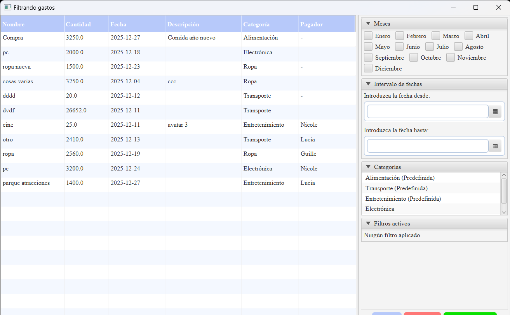

To **import expenses from an external file**, go to the top bar of the application. Once there, click "Gastos" -> "Importar Gastos" (Import Expenses). A tab will open where you can browse your device and select the expense file you want to import.

To **create a category**, go to the top bar of the application. Once there, click "Categorias" (Categories) -> "Crear Categoria" (Create Category). A tab will open where you can enter the name of the new category and create it by clicking "Crear Categoria".
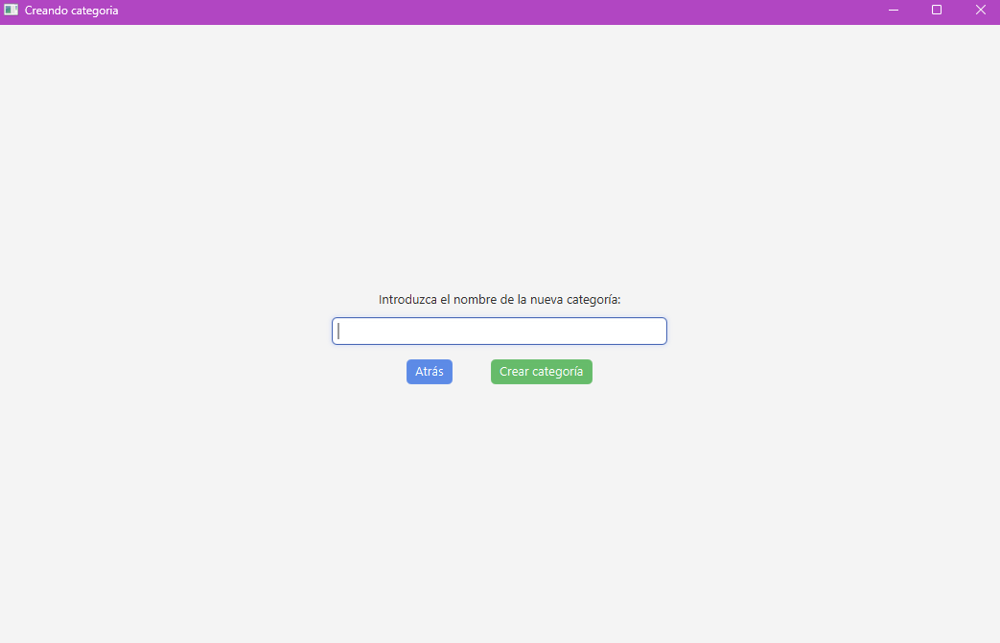

To **delete a category**, go to the top bar of the application. Once there, click "Categorias" -> "Eliminar Categoria" (Delete Category). A dropdown will open where you can select the name of the category you want to delete.

To **create an alert**, go to the top bar of the application. Once there, click "Alertas" (Alerts) -> "Crear Alerta" (Create Alert). A tab will open where you can set the alert details and create it by clicking "Crear Alerta".
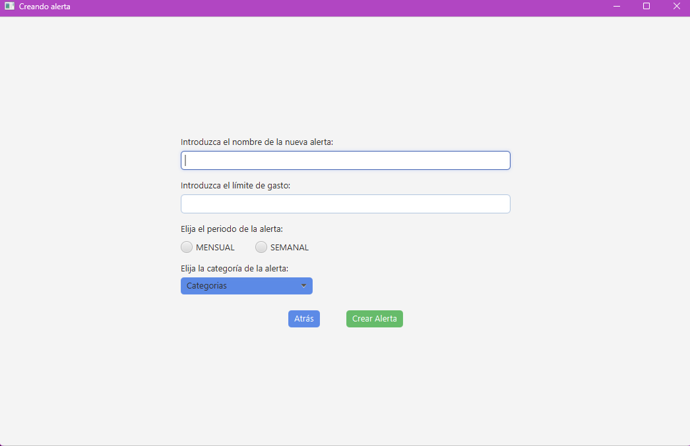

To **delete an alert**, go to the top bar of the application. Once there, click "Alertas" -> "Eliminar Alerta" (Delete Alert). A dropdown will open where you can select the name of the alert you want to delete.

To **view active alerts**, go to the top bar of the application. Once there, click "Alertas" -> "Ver Alerta" (View Alert). A tab will open where you can see the list of active alerts. Here, you are also given the option to click on an alert and press "Eliminar Alerta" (Delete Alert).
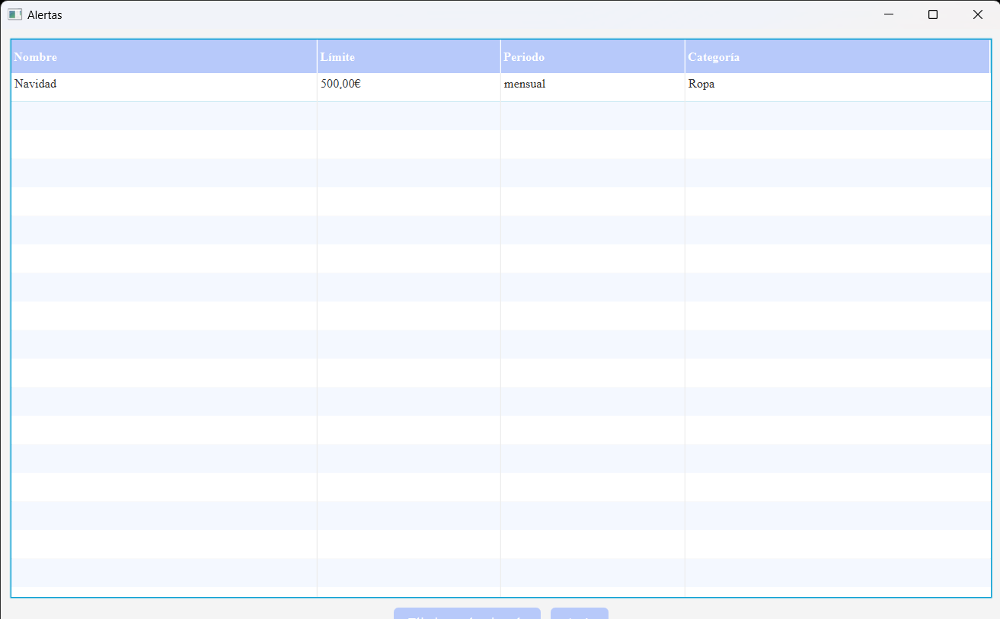

To **view the notification history**, go to the top bar of the application. Once there, click "Notificaciones" (Notifications) -> "Historial" (History). A tab will open where you can mark notifications as read or delete notifications from the history.
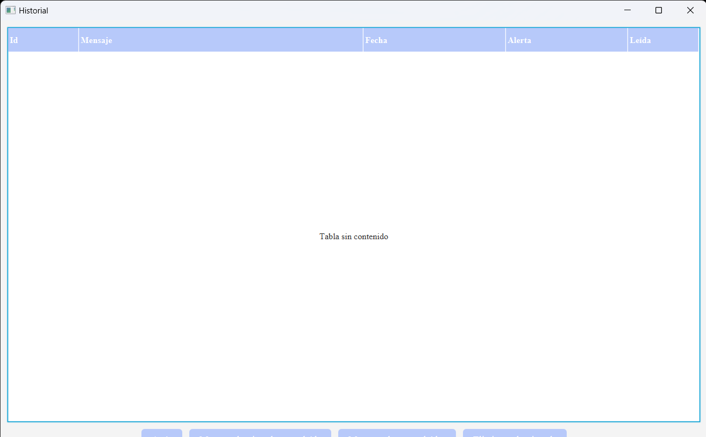

To **view the main window of a shared account** that is already created, click on the tab for that account.
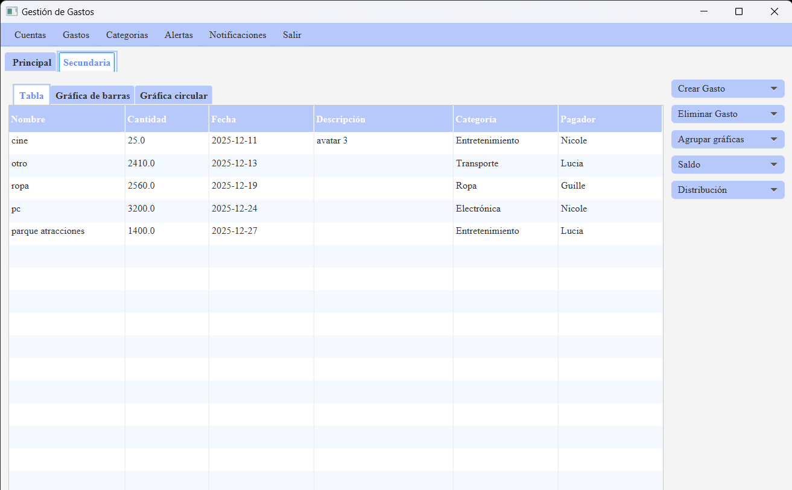

To **create an expense in a shared account**, click the "Crear Gasto" (Create Expense) button located to the right of the expense list. Then, click "Gasto Nuevo" (New Expense). A tab will open where you must enter the expense details (this time, also entering which person in the account made the expense) and click "Aceptar".
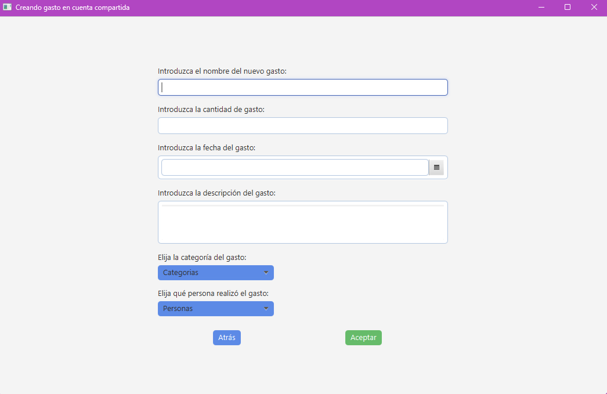

To **define the percentage of expense assumed by each person**, click the "Distribucion" (Distribution) -> "Personalizar" (Customize) button located to the right of the shared account's expense list. A tab will open where you can enter the percentage for each member and, by clicking "Aplicar" (Apply), the new expense percentage is defined.
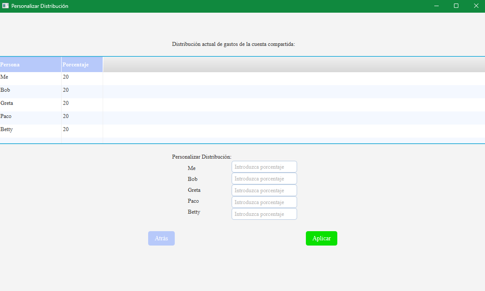

To see the **expense per person in a shared account**, click the "Saldo" (Balance) -> "Por persona" (Per person) button located to the right of the shared account's expense list. A tab will open where you can view the expense per person.
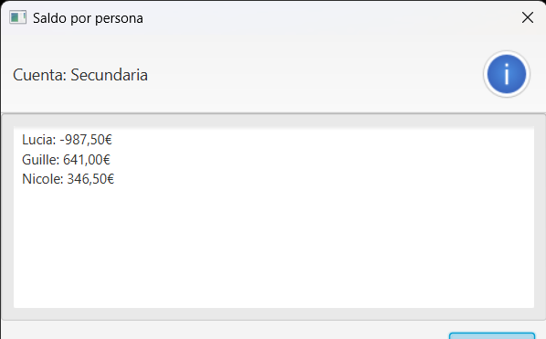

Both the bar and pie charts can be consulted in the same way as for the Principal account, by clicking the "Gráfica de barras" and "Gráfica circular" tabs respectively. However, we can now **sort shared account expenses by category or by person**.
To do this, check "Por persona" (By person) or "Por categoría" (By category) in the button located to the right of the shared account's expense list.
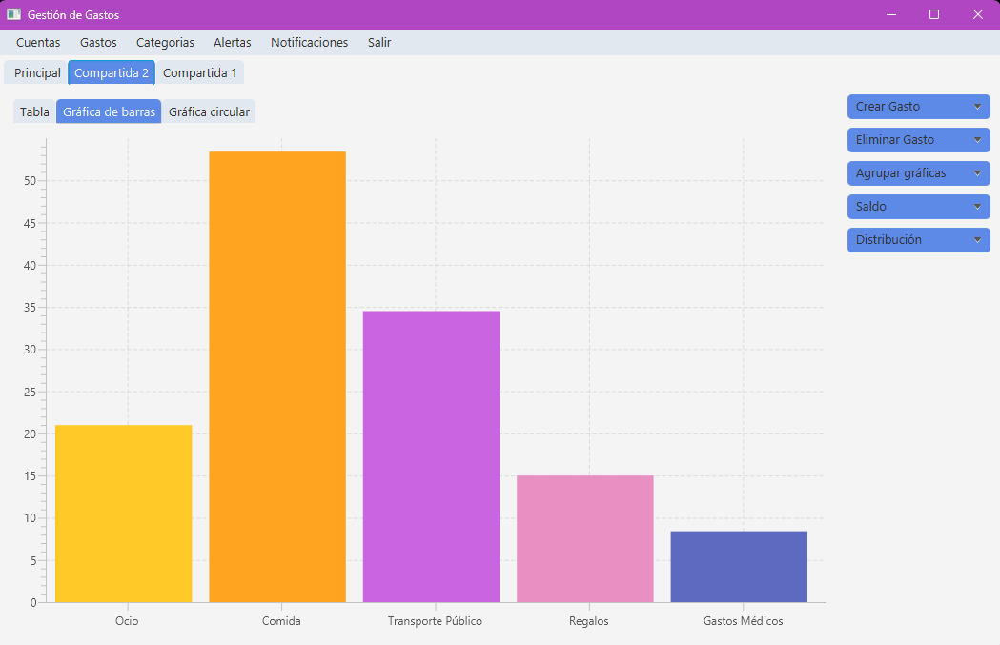

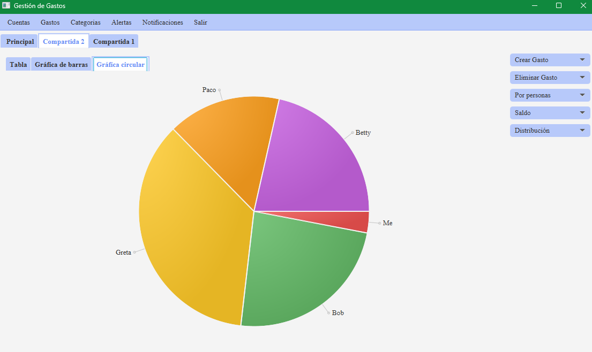

To **exit the application**, go to the top bar of the application. Once there, click "Salir" (Exit). A tab will open asking if you want to exit. Click "Aceptar" to exit.
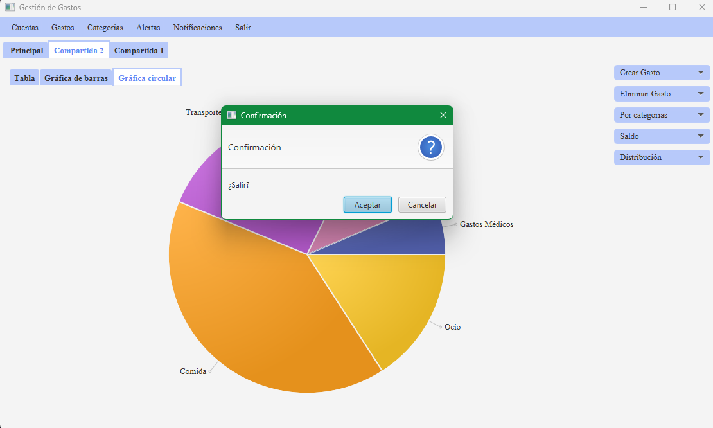